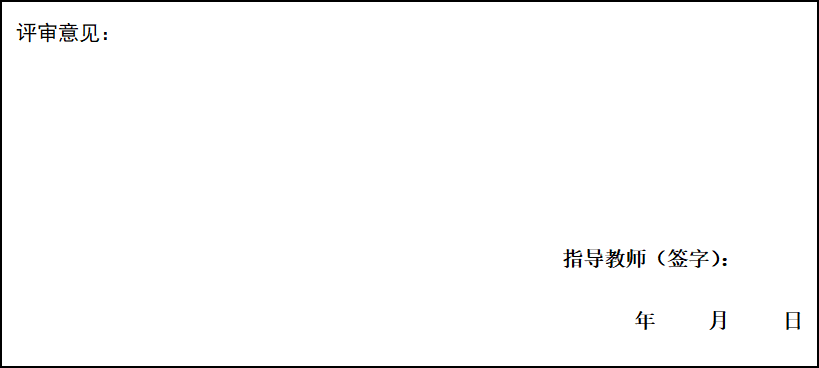

 

 

 

 

 

 

**西南大学**

**计算机与信息科学学院**

 

 智能系统综合实践报告

 

 

 

***\*课\**** ***\*程：\****       **学年设计**      

 

***\*题\**** ***\*目：\****                 

 

***\*级、专业：\****    ***\*级\****     ***\*专业\****    ***\*班\****

 

***\*学生姓名：\****                

 

***\*提交日期：\****      ***\*年\****    ***\*月\****    ***\*日\****

 

 

 

 

 

 

 

 

 

 

| ***\*内容提要：\****                         |
| -------------------------------------------- |
| ***\*关键词：\****                           |
| ***\*参考书目：\****  参见正文中“参考文献”。 |

 

 

# **1** ***\*概述\****

智能系统综合实践主要完成的任务、目标和问题描述。

## **1.1** ***\*问题描述\****

[学年设计问题描述,清晰地陈述工作背景、以及**自己要解决什么问题]**

## **1.2** ***\*目标\****

[清晰地陈述要达到的目标（**目标定义**）。

## **1.3** ***\*任务\****

[如果是多人合作, 请清楚写明每个人的工作分工, 然后**重点陈述自己应该要完成哪些任务**。

# **2** ***\*基本概念和方法、工具\****

## ***\*2\*******\*.1\*******\*软件开发基本概念\****

[软件生命周期，软件工程关于软件开发的基本概念等。]

[**最后决定自己选用“结构化”还是“面向对象”的方法进行软件开发。**]

## ***\*2.2\*******\*关键技术\****

[开发/运行需要的关键技术支持。如微软的、苹果的、谷歌的等。这里**只选择一个自己要用的关键技术/平台进行陈述**]

## ***\*2.\*******\*3 硬件要求\****

[陈述支持软件运行的最低硬件的基本配置。]

 

# **3** ***\*设计方案\**** 

给出设计方案和实现路径（包括总体设计思路、界面设计、数据库设计等，根据任务的不同进行选择性说明，根据选择分析和设计手段的不同（结构化或面向对象）选择性说明

## ***\*3\*******\*.1\**** ***\*需求分析\****

## ***\*3\*******\*.\*******\*2 xxx\****

## ***\*3\*******\*.\*******\*3\**** ***\*xxx\****

## ***\*3\*******\*.\*******\*4\**** ***\*xxx\****

# **4** ***\*源代码及实现\****

[主要模块功能实现说明，主要算法的说明和流程图，最好以总-分的形式展开]

# **5** ***\*使用说明\****

[结合界面和功能点（用例）做出简要介绍]

# **6** ***\*总结\****

[对所运用的相关理论和技术进行总结]

# ***\*参考文献\****

[1]  张海藩.软件工程导论(第四版)[M].清华大学出版社,2003.12.4.

[2]  李刚.轻量级Java EE企业应用实战(第三版)[M].[电子工业出版社](http://www.dangdang.com/publish/%B5%E7%D7%D3%B9%A4%D2%B5%B3%F6%B0%E6%C9%E7_1). 2012.4.1

[3]  Nicholas S. Williams. Professional Java for Web Applications (1st Edition) [M]. Wrox.2014.3.10 

[4]  关键词/标题，http://www.********.***/******, 年-月-日

[5]  刘广珠.高中生考试焦虑成因分析[J].陕西师大学报（哲社版），1995，24（1）：161-164.

[6]  郑  霖，柴宗新，郑远昌，等.四川省地理[M].四川科学技术出版社，1994.108-111.

 

 

 